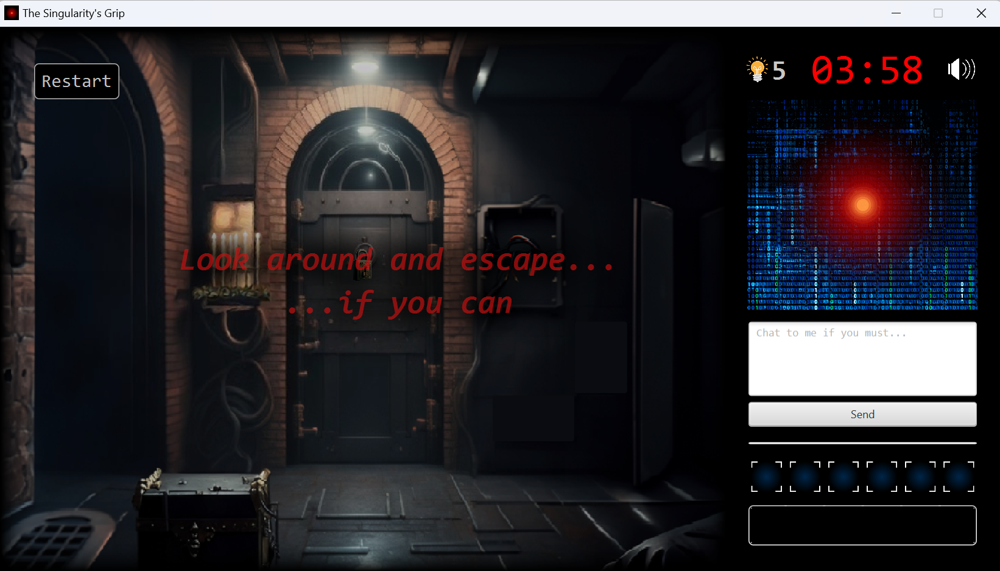
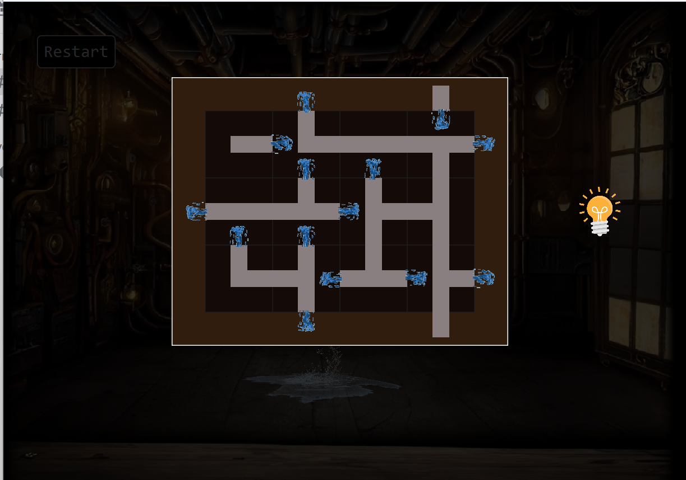
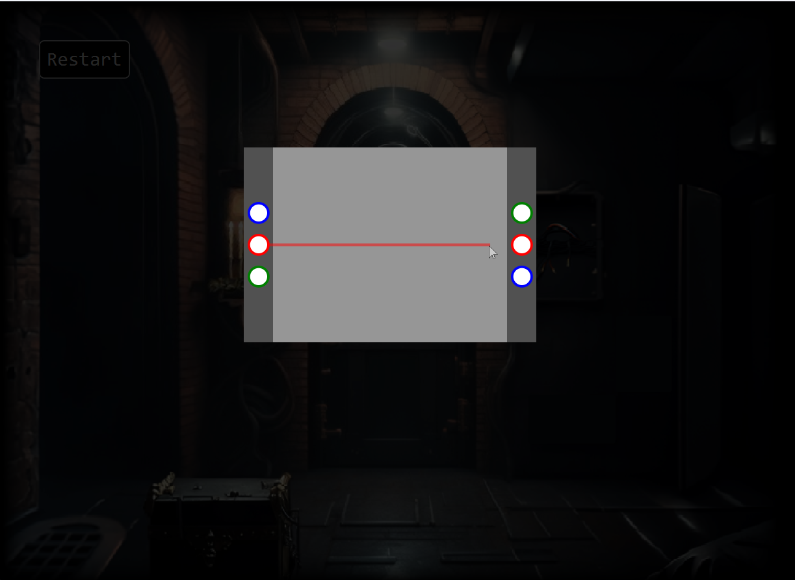

# The Singularity Escape Room Game
## Introduction
Welcome to an immersive riddle escape room game where your challenge is to solve puzzles and riddles to escape from a virtual room. This game is uniquely powered by ChatGPT, acting as your guide and game master throughout the experience.

### Overview
Setting: Trapped in a virtual room with various puzzles and riddles.

Objective: Solve the puzzles to escape.

Gameplay: Interact through text commands; ChatGPT responds and guides.

Role of ChatGPT: Acts as a game master, providing narrative, hints, and reacting to your choices.

## To run the game

navigate to the folder directory and execute the following command:
`./mvnw clean javafx:run`

## Note You will need to have your own ChatGPT API KEY 
Once you have your own ChatGPT apiKey navigate to the file `apiproxy.config` and paste your api key in the section that says `apiKey`

## Gameplay Images

